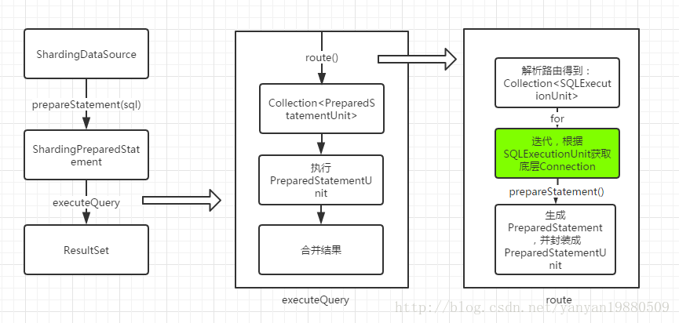

#### 读写分离原理解读  
参考：http://blog.csdn.net/yanyan19880509/article/details/78170233  

#### sharding-jdbc读写分离特性  
##### 支持项  
> * 提供了一主多从的读写分离配置，可独立使用，也可配合分库分表使用。
> * 独立使用读写分离支持SQL透传。 
> * 同一线程且同一数据库连接内，如有写入操作，以后的读操作均从主库读取，用于保证数据一致性。  
> * Spring命名空间。  
> * 基于Hint的强制主库路由。  

##### 不支持范围  
> * 主库和从库的数据同步。  
> * 主库和从库的数据同步延迟导致的数据不一致。  
> * 主库双写或多写(不支持批量写操作)  

#### 读写分离实现原理  
一般我们是这样来执行sql语句的：  
```
  Connection conn = dataSource.getConnection();
  PreparedStatement preparedStatement = conn.prepareStatement(sql);
  preparedStatement.executeQuery();  
```  
这是利用原生jdbc操作数据库查询语句的一般流程，获取一个连接，然后生成Statement，最后再执行查询。那么sharding-jdbc是在哪一块进行扩展从而实现读写分离的呢？  
想一下，想要实现读写分离，必然会涉及到多个底层的Connection，从而构造出不同连接下的Statement语句，而很多第三方软件，如Spring，为了实现事务，调用dataSource.getConnection()之后，在一次请求过程中，可能就不会再次调用getConnection方法了，所以在dataSource.getConnection中做读写扩展是不可取的。为了更好的说明问题，看下面的例子：  
```  
Connection conn = getConnection();
PreparedStatement preparedStatement1 = conn.prepareStatement(sql1);
preparedStatement1.executeQuery();

Connection conn2 = getConnection();
PreparedStatement preparedStatement2 = conn2.prepareStatement(sql2);
preparedStatement2.executeUpdate();  
```  
一次请求过程中，为了实现事务，一般的做法是当线程第一次调用getConnection方法时，获取一个底层连接，然后存储到ThreadLocal变量中去，下次就直接在ThreadLocal中获取了。为了实现一个事务中，针对一个数据源，既可能获取到主库连接，也可能获取到从库连接，还能够切换，sharding-jdbc在PreparedStatement(实际上为ShardingPreparedStatement)的executeXX层进行了主从库的连接处理。  
下图为sharding-jdbc执行的部分流程：  
  

